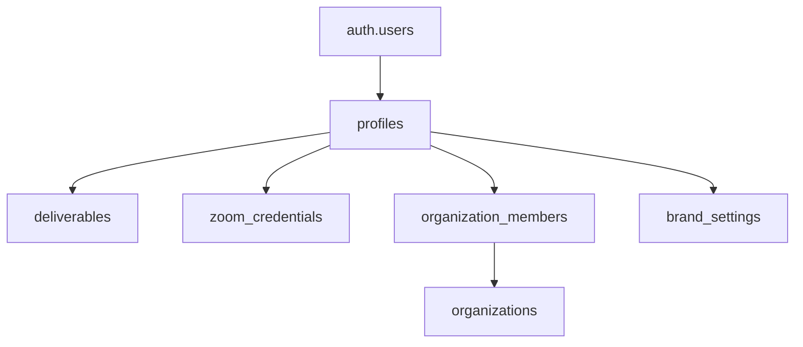

# Database Schema Overview

The Momentum backend uses Supabase (PostgreSQL) as its primary database. This document outlines the complete database schema including all tables, relationships, and constraints.

## Database Overview

- **Database Type**: PostgreSQL (via Supabase)
- **Authentication**: Supabase Auth with RLS (Row Level Security)
- **Storage**: Supabase Storage for file uploads
- **Migrations**: Manual schema management with SQL scripts

## Core Tables

### `profiles`
User profile information linked to Supabase Auth users.

```sql
CREATE TABLE profiles (
    id UUID PRIMARY KEY REFERENCES auth.users(id),
    email TEXT NOT NULL,
    name TEXT,
    avatar_url TEXT,
    created_at TIMESTAMPTZ DEFAULT NOW(),
    updated_at TIMESTAMPTZ DEFAULT NOW()
);
```

**Indexes:**
- Primary key on `id`
- Unique index on `email`

**RLS Policies:**
- Users can read/update their own profile
- Public read access for organization members

### `organizations`
Multi-tenant organization management.

```sql
CREATE TABLE organizations (
    id UUID PRIMARY KEY DEFAULT gen_random_uuid(),
    name TEXT NOT NULL,
    slug TEXT UNIQUE NOT NULL,
    logo_url TEXT,
    created_at TIMESTAMPTZ DEFAULT NOW(),
    updated_at TIMESTAMPTZ DEFAULT NOW()
);
```

**Constraints:**
- `slug` must be unique across all organizations
- `name` cannot be empty

### `organization_members`
Organization membership with role-based access.

```sql
CREATE TABLE organization_members (
    id UUID PRIMARY KEY DEFAULT gen_random_uuid(),
    user_id UUID NOT NULL REFERENCES profiles(id) ON DELETE CASCADE,
    organization_id UUID NOT NULL REFERENCES organizations(id) ON DELETE CASCADE,
    role TEXT NOT NULL CHECK (role IN ('owner', 'admin', 'member', 'viewer')),
    created_at TIMESTAMPTZ DEFAULT NOW(),
    updated_at TIMESTAMPTZ DEFAULT NOW(),
    UNIQUE(user_id, organization_id)
);
```

**Indexes:**
- Composite unique index on `(user_id, organization_id)`
- Index on `organization_id` for efficient lookups

### `deliverables`
Core deliverable storage with user ownership.

```sql
CREATE TABLE deliverables (
    id TEXT PRIMARY KEY,  -- UUID as text for custom IDs
    user_id UUID NOT NULL REFERENCES profiles(id) ON DELETE CASCADE,
    client_name TEXT NOT NULL,
    html TEXT NOT NULL,
    created_at TIMESTAMPTZ DEFAULT NOW()
);
```

**Indexes:**
- Primary key on `id`
- Index on `user_id` for user-scoped queries
- Index on `created_at` for chronological ordering

**RLS Policies:**
- Users can only access their own deliverables
- Organization members can access shared deliverables (future)

### `brand_settings`
Brand customization settings (global or user-scoped).

```sql
CREATE TABLE brand_settings (
    id UUID PRIMARY KEY DEFAULT gen_random_uuid(),
    user_id UUID REFERENCES profiles(id) ON DELETE CASCADE,  -- NULL for global settings
    primary_color TEXT DEFAULT '#2A3EB1',
    secondary_color TEXT DEFAULT '#4C6FE7',
    logo_url TEXT,
    created_at TIMESTAMPTZ DEFAULT NOW(),
    updated_at TIMESTAMPTZ DEFAULT NOW()
);
```

## Integration Tables

### `zoom_credentials`
Zoom OAuth credentials with automatic token refresh.

```sql
CREATE TABLE zoom_credentials (
    id UUID PRIMARY KEY DEFAULT gen_random_uuid(),
    user_id UUID UNIQUE NOT NULL REFERENCES profiles(id) ON DELETE CASCADE,
    access_token TEXT NOT NULL,
    refresh_token TEXT NOT NULL,
    expires_at TIMESTAMPTZ NOT NULL,
    zoom_user_id TEXT,
    zoom_email TEXT,
    created_at TIMESTAMPTZ DEFAULT NOW(),
    updated_at TIMESTAMPTZ DEFAULT NOW()
);
```

**Security Features:**
- Tokens should be encrypted at rest (implementation detail)
- Automatic cleanup of expired credentials
- One credential set per user (UNIQUE constraint)

**Indexes:**
- Primary key on `id`
- Unique index on `user_id`
- Index on `expires_at` for cleanup jobs

## Storage Buckets

### `logos`
Brand logo storage (public bucket).

```sql
-- Supabase Storage Bucket Configuration
CREATE BUCKET logos
WITH (public = true, file_size_limit = 5242880);  -- 5MB limit
```

**Allowed File Types:**
- PNG, JPEG, SVG
- Maximum size: 5MB
- Public read access

### `private`
Private file storage for PDFs and other sensitive content.

```sql
-- Supabase Storage Bucket Configuration
CREATE BUCKET private
WITH (public = false, file_size_limit = 52428800);  -- 50MB limit
```

**Access Control:**
- Private bucket with signed URLs
- User-scoped access policies
- Automatic cleanup policies

## Relationships and Constraints

### User-Centric Design
All core data is scoped to users through foreign key relationships:



### Cascade Behavior
- **ON DELETE CASCADE**: Removing a user removes all their data
- **ON DELETE RESTRICT**: Organizations cannot be deleted if they have members
- **Foreign Key Constraints**: Maintain referential integrity

## Row Level Security (RLS)

### Enabled Tables
RLS is enabled on all tables containing user data:

```sql
-- Enable RLS on core tables
ALTER TABLE profiles ENABLE ROW LEVEL SECURITY;
ALTER TABLE deliverables ENABLE ROW LEVEL SECURITY;
ALTER TABLE zoom_credentials ENABLE ROW LEVEL SECURITY;
ALTER TABLE organization_members ENABLE ROW LEVEL SECURITY;
ALTER TABLE brand_settings ENABLE ROW LEVEL SECURITY;
```

### Example Policies

**Deliverables Access:**
```sql
CREATE POLICY "Users can access own deliverables" ON deliverables
    FOR ALL USING (auth.uid() = user_id);
```

**Organization Member Access:**
```sql
CREATE POLICY "Members can view organization" ON organizations
    FOR SELECT USING (
        id IN (
            SELECT organization_id
            FROM organization_members
            WHERE user_id = auth.uid()
        )
    );
```

## Indexes for Performance

### Critical Indexes
```sql
-- Deliverables by user and date
CREATE INDEX idx_deliverables_user_created
ON deliverables(user_id, created_at DESC);

-- Organization member lookups
CREATE INDEX idx_org_members_user
ON organization_members(user_id);

-- Zoom credential expiration
CREATE INDEX idx_zoom_credentials_expires
ON zoom_credentials(expires_at);
```

## Data Types and Validation

### UUID Generation
- Use `gen_random_uuid()` for new UUIDs
- Consistent UUID format across all tables
- Primary keys use UUID for security and distribution

### Timestamp Handling
- All timestamps in UTC (`TIMESTAMPTZ`)
- Automatic `created_at` timestamps
- Manual `updated_at` management in application layer

### Text Constraints
```sql
-- Example constraints
ALTER TABLE organizations
ADD CONSTRAINT org_name_not_empty
CHECK (length(name) > 0);

ALTER TABLE organization_members
ADD CONSTRAINT valid_role
CHECK (role IN ('owner', 'admin', 'member', 'viewer'));
```

## Migration Strategy

### Schema Versioning
- Sequential numbered migrations
- Rollback scripts for each migration
- Environment-specific migration tracking

### Migration Process
1. Development schema changes
2. Migration script creation
3. Staging environment testing
4. Production deployment with rollback plan

## Backup and Recovery

### Supabase Managed Backups
- Automatic daily backups
- Point-in-time recovery available
- Cross-region backup replication

### Data Export
- Periodic data exports for compliance
- User data portability features
- Automated backup verification